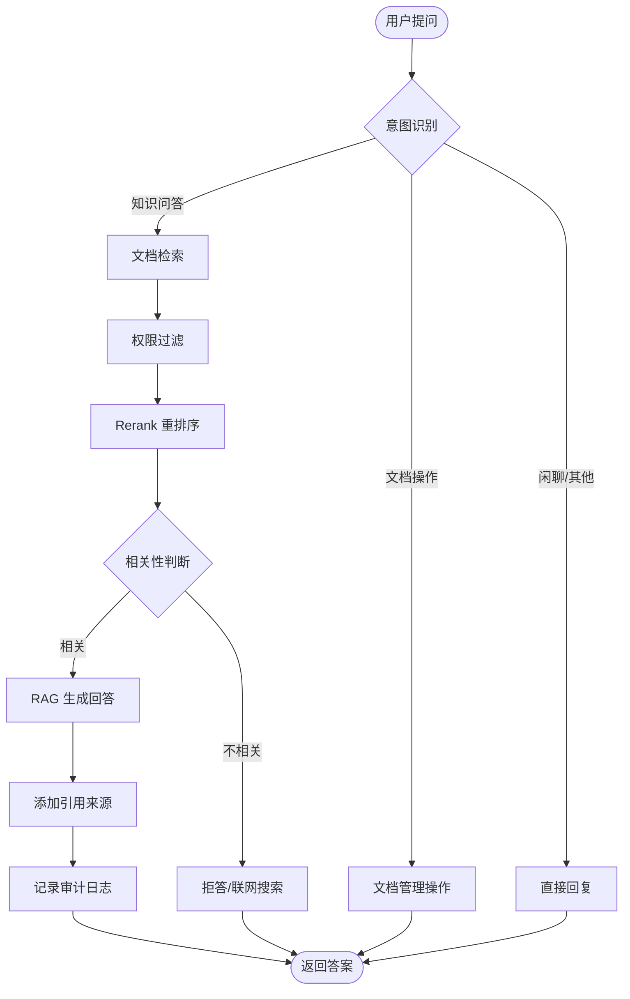
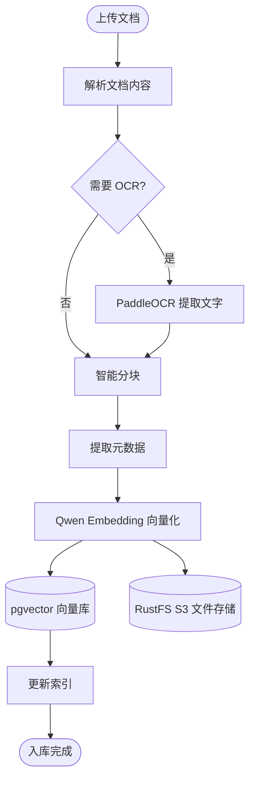
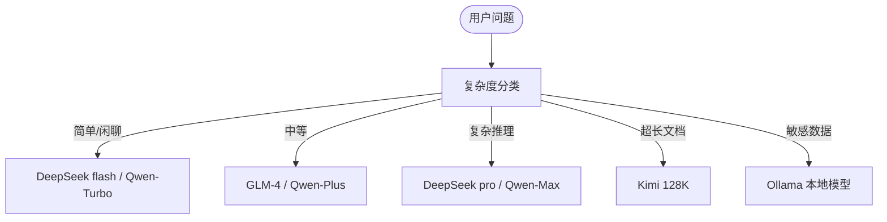

# 公司内部文档整理与问答智能体 — 设计方案

> **版本**: v0.2  
> **状态**: Phase 3 开发中  
> **最后更新**: 2026-06-03

---

## 一、项目目标

构建一个面向公司内部的**智能文档整理与知识问答系统**，帮助员工快速查找、理解和利用分散在各处的内部文档（规章制度、技术文档、项目 Wiki、会议纪要、合同等），通过自然语言问答的方式降低知识获取门槛。

---

## 二、核心任务拆解

### 2.1 文档接入与预处理

| 任务 | 说明 |
|---|---|
| **多格式文档解析** | 支持 PDF、Word (.docx)、Markdown、纯文本、HTML、图片（OCR） |
| **智能分块 (Chunking)** | 基于语义边界的分块策略，支持重叠窗口、按标题/段落切分 |
| **元数据提取** | 自动提取文档标题、作者、日期、部门、标签等元信息 |
| **OCR 识别** | 扫描件/图片中的文字提取（PaddleOCR / Tesseract） |
| **表格处理** | PDF/Word 中表格的结构化提取与理解 |

### 2.2 向量化与存储

| 任务 | 说明 |
|---|---|
| **Embedding 生成** | 调用阿里 Qwen Embedding API 生成 1024/1536 维文本向量 |
| **向量入库** | 存入 PostgreSQL + pgvector，支持 IVFFlat / HNSW 索引加速 |
| **原始文件存储** | 文件存入 MinIO (S3 兼容)，数据库中仅存文件路径/URL |
| **增量更新** | 文档变更时，支持增量重建索引（按文档粒度失效旧向量） |

### 2.3 智能检索

| 任务 | 说明 |
|---|---|
| **混合检索** | 向量相似度检索 + 关键词全文检索（BM25）融合 |
| **Rerank 重排序** | 召回后使用 bge-reranker-v2 等模型精排，提升 Top-K 精度 |
| **元数据过滤** | 按部门、日期、文档类型、标签等条件过滤检索范围 |
| **父文档召回** | 检索到 chunk 后，可回溯完整父文档上下文 |

### 2.4 智能问答

| 任务 | 说明 |
|---|---|
| **RAG 问答** | 检索增强生成：召回相关文档片段 → 拼入 prompt → LLM 生成回答 |
| **多轮对话** | 支持上下文连续追问，对话历史存储于 PostgreSQL |
| **引用溯源** | 回答中标注信息来源（文档名、页码、链接），支持点击跳转 |
| **拒答机制** | 当知识库无相关内容时，明确告知用户而非编造 |
| **多模型路由** | 简单问题走 cheap/fast 模型，复杂推理走 powerful 模型 |
| **热点问答缓存** | Redis 缓存高频问答对，相同/相似问题直接返回缓存结果，省去 LLM 调用 |

#### 2.4.1 热点问答缓存策略

```
用户提问 → 语义哈希 → Redis 查询
                      ├── 命中 → 直接返回缓存答案（< 5ms）
                      └── 未命中 → RAG 流程 → LLM 生成 → 写入 Redis → 返回
```

- **缓存键**：对问题进行标准化（去标点、去空白、小写化）后取语义向量 → LSH 分桶，同一桶内视为相似问题
- **缓存值**：`{answer, sources, model, timestamp}` JSON
- **过期策略**：TTL 默认 24h（可配置），文档更新时主动失效关联缓存
- **适用场景**：高频制度查询（"年假怎么算"）、FAQ 类问题、新人常见问题
- **不缓存场景**：带时间敏感词的问题（"最近/今天/本周"）、要求最新信息的问题

### 2.5 知识管理与组织

#### 2.5.1 自动分类打标

文档入库后，异步调用 LLM（如 DeepSeek flash / Qwen-Turbo）对文档进行自动分类和打标：

- **分类体系**：预定义类别树（如：规章制度 > 考勤制度、技术文档 > 后端 > Python、项目文档 > 周报 等），支持管理员自定义
- **标签维度**：部门标签（财务部/技术部/人事部）、时效标签（长期有效/年度更新/已废止）、质量标签（正式版/草案/过时）
- **实现方式**：少量示例 Few-shot Prompt → LLM 输出 JSON `{categories: [...], tags: [...]}` → 写入 `documents.tags` 和 `documents.category_id`
- **人工纠偏**：管理后台支持手动修正分类和标签，修正结果作为 Few-shot 示例回补 Prompt，持续提升准确率

#### 2.5.2 文档摘要

对长文档自动生成三级摘要，满足不同场景的粒度需求：

| 级别 | 长度 | 用途 | 触发时机 |
|---|---|---|---|
| **一句话摘要** | ≤50 字 | 检索结果列表展示、文档列表概览 | 入库时自动生成 |
| **段落摘要** | 200~300 字 | 搜索命中后的快速预览 | 入库时自动生成 |
| **详细摘要** | 按章节分段 | 全文概览、替代通读原文 | 用户按需触发（懒加载） |

实现：调用 Kimi/Qwen-Max 等长文本模型，Map-Reduce 策略处理超长文档（先分段生成段落摘要，再汇总成全文摘要）。

#### 2.5.3 相似文档推荐

基于文档向量相似度，在检索结果或文档详情页推荐相关内容：

- **方法**：文档级向量（取所有 chunk embedding 的均值/最大值池化）→ pgvector 余弦相似度 Top-N
- **过滤**：排除同文档、按部门/标签可筛选
- **场景**：搜索结果页侧栏推荐、文档详情页"相关文档"、问答结果附带"你可能还想看"

#### 2.5.4 知识图谱（可选进阶）

- **实体抽取**：LLM + 正则 抽取文档中的关键实体（人名、部门、项目名、术语、日期、金额等）
- **关系构建**：识别实体间关系（引用、依赖、替代、归属、审批等）
- **应用**：关联文档导航、知识溯源（"这个制度引用了哪些法规？"）、影响分析（"这个流程变更影响哪些文档？"）

### 2.6 权限与安全

| 任务 | 说明 |
|---|---|
| **用户认证** | JWT Token 登录，支持 SSO/LDAP 对接 |
| **部门级权限** | 按部门/角色控制文档访问范围（RBAC） |
| **审计日志** | 记录所有查询和文档访问行为 |
| **敏感信息检测** | 检测并脱敏身份证号、手机号等敏感信息 |

---

## 三、技术栈总览

```
┌─────────────────────────────────────────────────────────────────┐
│                        前端                                       │
│               Web Chat UI / 管理后台 (Vue 3 + Vite)               │
└─────────────────────────────────────────────────────────────────┘
                                  │
                                  ▼
┌─────────────────────────────────────────────────────────────────┐
│                     API 网关层 (FastAPI)                          │
│         路由 / 鉴权 / 限流 / 请求日志 / 文件上传                    │
└─────────────────────────────────────────────────────────────────┘
                                  │
          ┌───────────────────────┼───────────────────────┐
          ▼                       ▼                       ▼
┌─────────────────┐    ┌─────────────────┐    ┌─────────────────┐
│  Agent 编排层    │    │  文档处理流水线   │    │  系统监控层      │
│  (LangGraph)     │    │  (LangChain)     │    │                 │
│                 │    │                 │    │  Langfuse        │
│  · 意图识别      │    │  · Loader        │    │  (LLM 追踪)     │
│  · 路由决策      │    │  · Splitter      │    │                 │
│  · RAG 流程      │    │  · Embedding     │    │  Prometheus      │
│  · 多步推理      │    │  · Vector Store  │    │  + Grafana       │
│  · 工具调用      │    │                 │    │  (系统监控)      │
└─────────────────┘    └─────────────────┘    └─────────────────┘
          │                       │
          ▼                       ▼
┌─────────────────────────────────────────────────────────────────┐
│                      模型服务层                                   │
│                                                                 │
│  ┌──────────┐ ┌──────────┐ ┌──────────┐ ┌──────────┐           │
│  │ DeepSeek │ │  GLM-4   │ │ Qwen-Plus│ │  Kimi    │  ...      │
│  │ v4 pro   │ │          │ │          │ │          │           │
│  └──────────┘ └──────────┘ └──────────┘ └──────────┘           │
│                         │                                       │
│              ┌──────────┴──────────┐                            │
│              │   本地 Ollama 服务    │                            │
│              │  (qwen2.5 / llama3) │                            │
│              └─────────────────────┘                            │
└─────────────────────────────────────────────────────────────────┘
          │
          ▼
┌─────────────────────────────────────────────────────────────────┐
│                      数据存储层                                   │
│                                                                 │
│  ┌───────────────────┐    ┌───────────────────┐                 │
│  │ PostgreSQL+pgvector│    │   RustFS (S3)      │                │
│  │                   │    │                   │                │
│  │ · 向量索引         │    │ · 原始文档存储      │               │
│  │ · 业务数据         │    │ · 图片/附件        │                │
│  │ · 对话历史         │    │                    │               │
│  │ · 用户/权限        │    │                    │               │
│  └───────────────────┘    └───────────────────┘                 │
└─────────────────────────────────────────────────────────────────┘
```

### 3.1 详细技术选型

| 层次 | 技术 | 用途 | 选型理由 |
|---|---|---|---|
| **Agent 框架** | LangChain + LangGraph | Agent 流程编排、RAG 管道 | 生态成熟、社区活跃、中文支持好 |
| **API 框架** | FastAPI | REST API 服务 | 高性能异步、自动 OpenAPI 文档 |
| **LLM 网关** | LiteLLM / 自建路由 | 统一多模型调用接口 | 屏蔽不同厂商 API 差异 |
| **Embedding** | Qwen Embedding (阿里) | 文本向量化 | 中文语义理解领先，1024/1536 维 |
| **向量数据库** | PostgreSQL + pgvector | 向量存储与检索 | 与业务库合一、运维简单、支持 HNSW |
| **对象存储** | RustFS (S3 兼容) | 原始文件存储 | Rust 实现、S3 API 兼容、高性能 |
| **LLM 监控** | Langfuse | LLM 调用链追踪、成本、延迟 | 开源、与 LangChain 原生集成 |
| **系统监控** | Prometheus + Grafana | 服务资源/性能监控 | 业界标配 |
| **OCR** | PaddleOCR / Tesseract | 图片/扫描件文字识别 | 中文 OCR 效果好 |
| **Reranker** | Qwen Rerank (阿里) | 检索结果重排序 | 中文效果好、与 Qwen Embedding 配套 |
| **缓存** | Redis | 热点问答缓存、会话状态 | 高性能缓存 |
| **任务队列** | Celery + Redis | 异步文档处理 | 大文档处理不阻塞 API |

### 3.2 模型列表

| 模型 | 提供方 | 调用方式 | 适用场景 |
|---|---|---|---|
| **DeepSeek v4 pro** | DeepSeek API | 云端 API | 复杂推理、长文档理解 |
| **DeepSeek v4 flash** | DeepSeek API | 云端 API | 简单问答、意图分类（快+便宜） |
| **GLM-4-Plus** | 智谱 API | 云端 API | 通用问答、知识抽取 |
| **Qwen-Plus/Max** | 阿里百炼 API | 云端 API | 中文理解、长文本 |
| **Kimi (Moonshot)** | Moonshot API | 云端 API | 超长文档（128K+ context） |
| **Ollama 本地模型** | 本地部署 | 本地 HTTP | 敏感数据不出域、离线场景 |

### 3.3 Embedding 模型

| 模型 | 维度 | 最大长度 | 提供方 |
|---|---|---|---|
| **Qwen3-Embedding-8B** | 4096 | 32K tokens | 阿里百炼 API |
| **text-embedding-v4** | 1024 | 8K tokens | 阿里百炼 API |

---

## 四、LangGraph Agent 工作流设计

### 4.1 主流程



### 4.2 文档入库流程



### 4.3 多模型路由策略



---

## 五、数据模型概要

### 5.1 PostgreSQL 核心表

```sql
-- 文档表
documents (
    id UUID PRIMARY KEY,
    title VARCHAR(500),
    file_type VARCHAR(50),        -- pdf, docx, md, txt
    file_path VARCHAR(1000),       -- RustFS (S3) 路径
    s3_url VARCHAR(2000),
    department VARCHAR(200),
    author VARCHAR(200),
    tags TEXT[],
    status VARCHAR(50),            -- active, archived, deleted
    created_at TIMESTAMP,
    updated_at TIMESTAMP
);

-- 文档分块表
document_chunks (
    id UUID PRIMARY KEY,
    document_id UUID REFERENCES documents(id),
    chunk_index INT,
    content TEXT,
    chunk_metadata JSONB,
    embedding VECTOR(1024),        -- pgvector 类型
    created_at TIMESTAMP
);

-- 对话历史表
conversations (
    id UUID PRIMARY KEY,
    user_id UUID,
    session_id UUID,
    role VARCHAR(20),
    content TEXT,
    sources JSONB,                 -- 引用来源
    created_at TIMESTAMP
);

-- 用户表
users (
    id UUID PRIMARY KEY,
    username VARCHAR(100) UNIQUE,
    department VARCHAR(200),
    role VARCHAR(50),
    permissions JSONB
);
```

---

## 六、监控与可观测性

| 维度 | 工具 | 监控内容 |
|---|---|---|
| **LLM 调用追踪** | Langfuse | 每次 LLM 调用的 prompt、completion、token 消耗、延迟、成本 |
| **Agent 决策追踪** | Langfuse | LangGraph 节点的输入输出、状态转换、工具调用 |
| **检索质量** | Langfuse | 召回率、精确率、Rerank 前后对比 |
| **服务性能** | Prometheus + Grafana | QPS、延迟分布、错误率、CPU/内存/磁盘 |
| **业务指标** | Prometheus + Grafana | 文档数量、问答量、用户活跃度、满意度 |
| **日志聚合** | ELK / Loki | 结构化日志、错误追踪 |

---

## 七、部署架构

```
┌──────────────────────────────────────────────────────────┐
│                    Docker Compose / K8s                    │
│                                                          │
│  ┌──────────┐  ┌──────────┐  ┌──────────┐               │
│  │ FastAPI  │  │ FastAPI  │  │ Celery   │               │
│  │ API x N  │  │ Admin    │  │ Worker   │               │
│  └──────────┘  └──────────┘  └──────────┘               │
│       │              │              │                     │
│  ┌────┴────┐  ┌──────┴──────┐  ┌──┴──────────┐          │
│  │ Redis   │  │ PostgreSQL  │  │  RustFS      │          │
│  │ (缓存)   │  │ + pgvector  │  │  (S3 存储)   │          │
│  └─────────┘  └─────────────┘  └─────────────┘          │
│                                                          │
│  ┌──────────┐  ┌──────────┐  ┌──────────┐               │
│  │ Langfuse │  │Prometheus│  │ Grafana  │               │
│  │ Server   │  │          │  │          │               │
│  └──────────┘  └──────────┘  └──────────┘               │
│                                                          │
│  ┌──────────┐                                           │
│  │ Ollama   │  (可选，本地模型)                            │
│  └──────────┘                                           │
└──────────────────────────────────────────────────────────┘
```

---

## 八、项目目录结构

> ✅ = 已完成  &nbsp;&nbsp;  📋 = 规划中

```
company-agent/
├── src/
│   ├── agent/                          # ✅ LangGraph Agent 编排
│   │   ├── prompts/                    # ✅ 系统提示词模板 (system.md)
│   │   ├── tools/                      # ✅ 工具 (DuckDuckGo 搜索)
│   │   └── workflow.py                 # ✅ Agent 工作流 (chat ⇄ tool_call 循环)
│   ├── config/
│   │   └── settings.py                 # ✅ 全局配置 (环境变量加载、多 provider 管理)
│   ├── data/
│   │   ├── models/                     # ✅ SQLModel ORM 模型 (User, Session)
│   │   ├── schemas/                    # ✅ Pydantic 请求/响应模型 (Chat, Auth, GraphState)
│   │   └── db_manager.py              # ✅ 数据库 CRUD 服务
│   ├── interface/                      # ✅ FastAPI 接口层
│   │   ├── auth.py                     # ✅ 认证 (注册/登录/会话/JWT)
│   │   ├── interaction.py             # ✅ 聊天 (同步/流式/历史管理)
│   │   └── router.py                   # ✅ 路由汇总
│   ├── services/
│   │   └── llm_provider.py            # ✅ LLM 服务 (多模型注册表 + 循环 fallback + 重试)
│   ├── system/                         # ✅ 系统基础设施
│   │   ├── logs.py                     # ✅ 结构化日志 (structlog JSONL/Console)
│   │   ├── middleware.py              # ✅ 请求日志 + Langfuse trace 中间件
│   │   ├── rate_limit.py              # ✅ 限流 (slowapi)
│   │   ├── telemetry.py               # ✅ Prometheus 指标
│   │   └── tracing.py                 # ✅ Langfuse 链路追踪 (trace/span/score)
│   ├── utils/
│   │   ├── auth.py                     # ✅ JWT 创建/验证
│   │   ├── graph.py                    # ✅ 消息预处理/截断/结构化响应解析
│   │   └── sanitization.py            # ✅ XSS/注入防护
│   └── main.py                         # ✅ 应用入口 (FastAPI + lifespan)
│
│   # --- 以下为 Phase 2-6 新增/规划模块 ---
│
│   ├── ingestion/                      # ✅ 文档接入处理 (Phase 2)
│   │   ├── loaders/                    # ✅ 多格式文档加载器 (PDF/Word/MD/HTML)
│   │   ├── splitters/                  # ✅ 语义分块策略
│   │   ├── ocr/                        # 📋 OCR 处理 (Phase 5)
│   │   └── pipeline.py                 # ✅ 入库流水线
│   ├── retrieval/                      # 🚧 检索模块 (Phase 3)
│   │   ├── vector_store.py            # 🚧 pgvector 向量操作
│   │   ├── bm25.py                     # 🚧 BM25 关键词检索
│   │   ├── hybrid.py                   # 🚧 混合检索融合
│   │   └── reranker.py                # 📋 重排序 (Phase 5)
│   ├── embedding/                      # ✅ Embedding 服务 (Phase 2)
│   │   └── qwen_embedding.py          # ✅ 阿里 Qwen Embedding 适配
│   ├── storage/                        # ✅ 文件存储层 (Phase 2)
│   │   └── s3_client.py               # ✅ RustFS (S3) 客户端
│   ├── auth/                           # 📋 权限增强 (Phase 5)
│   │   └── rbac.py                     # 📋 部门级 RBAC 权限控制
│   ├── classification/                 # 📋 自动分类打标 (Phase 5)
│   │   └── auto_tagger.py             # 📋 LLM 自动分类+标签
│   ├── summarization/                  # 📋 文档摘要 (Phase 5)
│   │   └── summarizer.py              # 📋 长文档自动摘要
│   └── recommendation/                 # 📋 相似文档推荐 (Phase 5)
│       └── similar_docs.py            # 📋 基于向量相似度的文档推荐
│
├── evals/                              # ✅ 评估模块
│   ├── metrics/                        # ✅ 评估指标
│   │   └── prompts/                    # ✅ 评估提示词
│   ├── evaluator.py
│   ├── helpers.py
│   ├── main.py
│   └── schemas.py
├── tests/                              # ✅ 测试
├── scripts/                            # ✅ 运维脚本 (Docker 构建/启停/日志)
├── prometheus/                         # ✅ Prometheus 配置
├── grafana/                            # ✅ Grafana 配置 + Dashboard JSON
├── logs/                               # ✅ 结构化日志文件
├── docker-compose.yml                  # ✅ Docker Compose (PostgreSQL+pgvector, App, Prometheus, Grafana, cAdvisor)
├── docker-compose-without-app.yml     # ✅ 仅基础设施 (不含 App)
├── Dockerfile                          # ✅ 多阶段构建
├── pyproject.toml                      # ✅ 项目构建配置
├── schema.sql                          # ✅ 数据库 DDL
├── Makefile                            # ✅ 开发常用命令
├── .env / .env.development / .env.example  # ✅ 环境配置
├── design.md                           # ✅ 本设计文档
└── LANGFUSE_TRACING_GUIDE.md           # ✅ Langfuse 集成指南
```

---

## 九、开发阶段规划

| 阶段 | 内容 | 关键交付 | 状态 |
|---|---|---|---|---|---|
| **Phase 1: 基础设施** | 搭建项目骨架、数据库、Langfuse、Prometheus | Docker Compose 一键启动所有服务 | ✅ 已完成 |

| **Phase 2: 文档入库** | PDF/Word/MD 解析、智能分块、元数据提取、表格提取、Embedding 入库、增量更新 | 文档上传 → 自动入库 → 可检索，支持增量重建索引 | ✅ 已完成 |

| **Phase 3: 基础问答** | RAG 流程（混合检索 + 父文档召回）、单轮问答、引用溯源、拒答机制 | 用户提问 → 返回带来源的答案 | 🚧 进行中 |

| **Phase 3.5: 前端 Chat UI** | Vue 3 Chat 聊天界面、流式输出、对话历史、引用展示 | 用户可通过浏览器直接使用问答系统 | 📋 规划中 |

| **Phase 4: 多模型路由** | 接入多模型、实现智能路由、fallback 策略、热点问答 Redis 缓存 | 不同问题走不同模型，高频问题直接缓存命中 | 📋 规划中 |

| **Phase 5: 高级功能** | 多轮对话增强、RBAC 权限控制、OCR + 表格提取、Rerank 重排序、自动分类打标、文档摘要、相似文档推荐、敏感信息检测脱敏 | 完整的生产级功能 | 📋 规划中 |

| **Phase 6: 管理与优化** | 管理后台（文档/用户管理+数据看板）、知识图谱、性能优化、A/B 测试 | 可运营的完整系统 | 📋 规划中 |

---